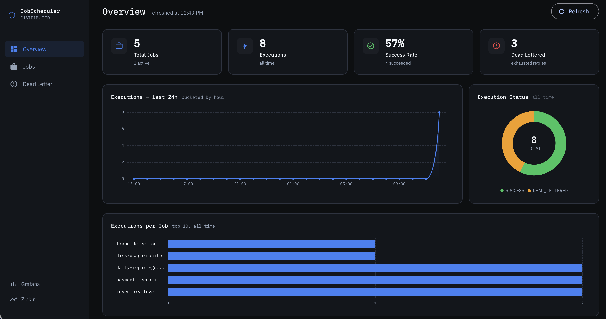
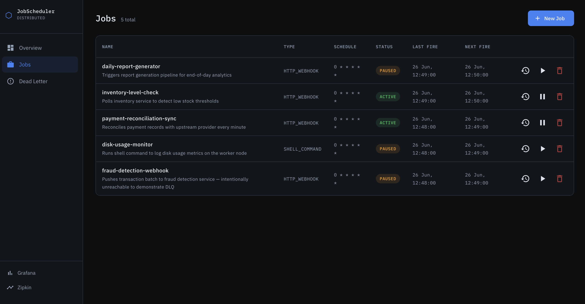
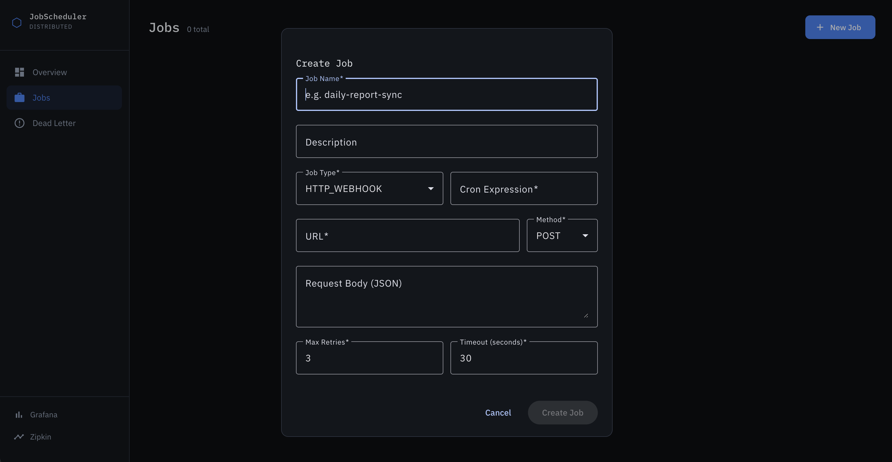
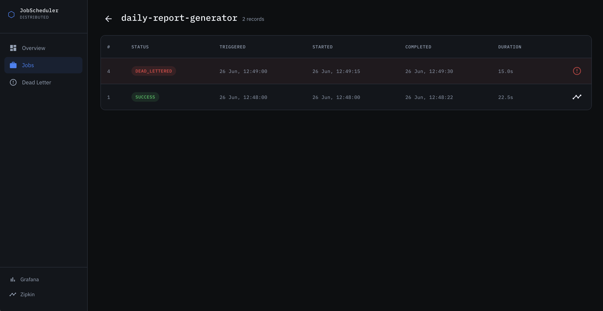
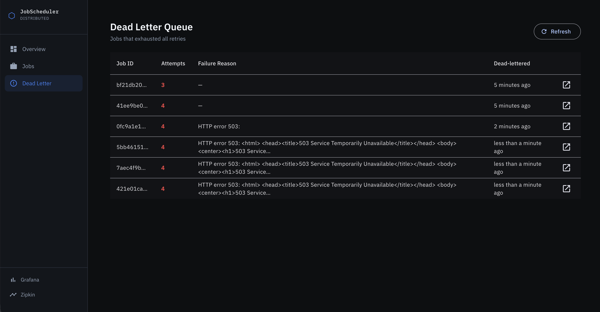
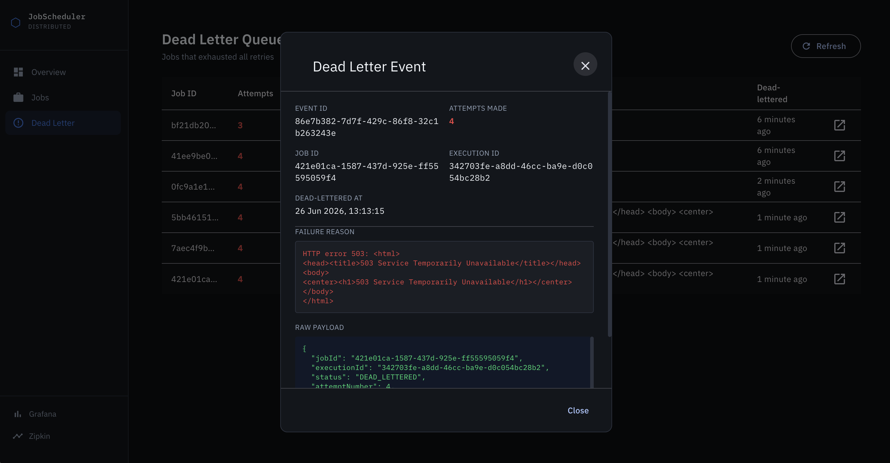
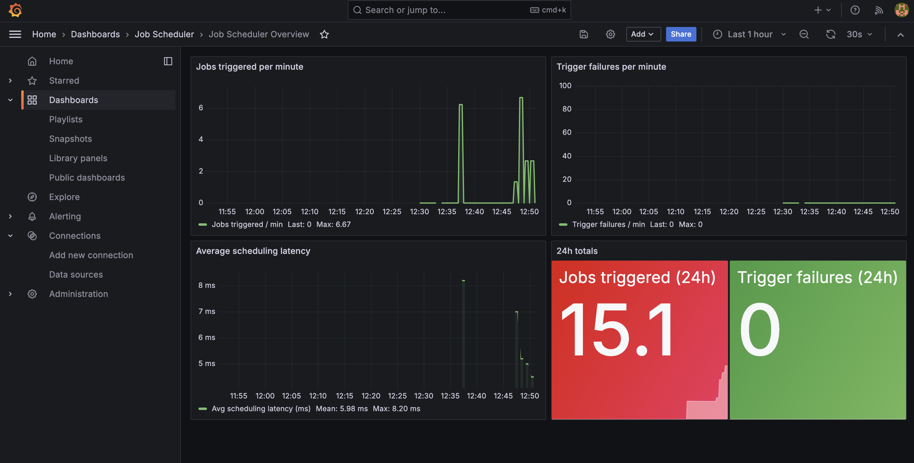
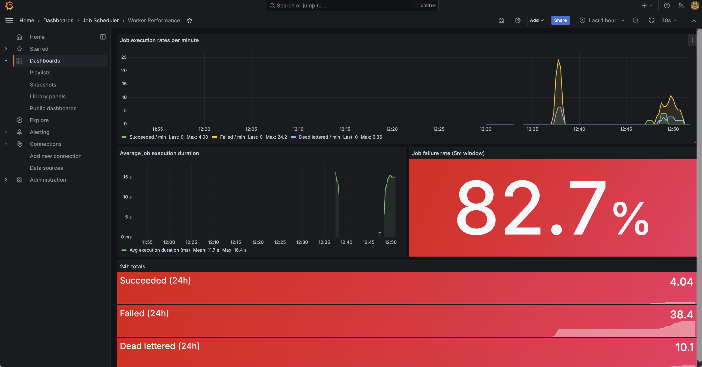
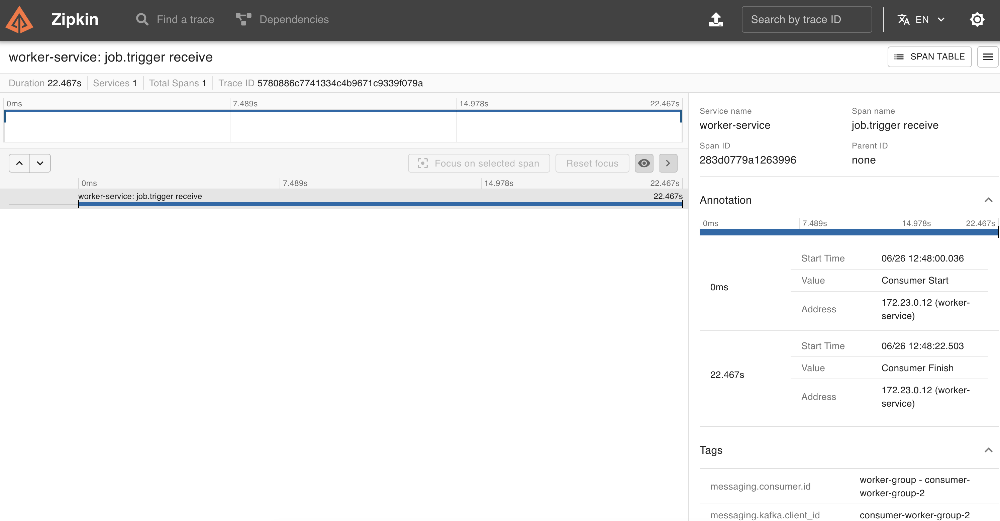
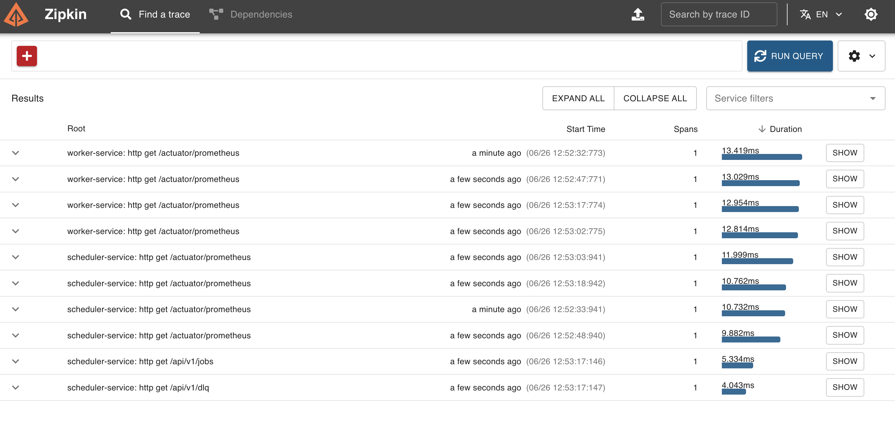

<div align="center">

# 🗓️ Distributed Job Scheduler

**A production-grade distributed job scheduling platform — think self-hosted Temporal or Celery.**

Users define cron-based jobs, monitor execution in real time, and get full observability across distributed workers.

*Built end-to-end to showcase senior full-stack engineering across microservices, event-driven architecture, distributed systems primitives, and modern frontend development.*

---

[](https://github.com/harshkhatri11/distributed-job-scheduler/actions/workflows/ci.yml)


</div>

---

---

## Table of Contents

- [Architecture](#architecture)
- [Tech Stack](#tech-stack)
- [Features](#features)
- [Gallery](#gallery)
- [Project Structure](#project-structure)
- [Getting Started](#getting-started)
- [API Reference](#api-reference)
- [Observability](#observability)
- [CI/CD](#cicd)
- [Key Engineering Decisions](#key-engineering-decisions)

---

## Architecture


### How it works

1. **Job defined** — user creates a cron job via REST API (e.g. `0 * * * * *` = every minute)
2. **Cron engine fires** — `scheduler-service` uses a `DelayQueue` (zero-polling) to evaluate the next fire time via Spring `CronExpression`
3. **Distributed lock acquired** — Redis `SET NX PX` prevents duplicate execution across multiple scheduler instances
4. **Event published** — job trigger payload sent to `job.trigger` Kafka topic (3 partitions)
5. **Worker executes** — `worker-service` consumes the event (concurrency=3, matching partitions), executes via HTTP webhook or shell command
6. **Result published** — worker publishes outcome to `job.result`; scheduler-service consumes and updates DB
7. **Retry on failure** — exponential backoff up to N retries per job; exhausted retries go to `job.dlq`
8. **DLQ captured** — DLQ consumer writes `DeadLetterEvent` to DB with full payload for inspection
9. **Full observability** — every step emits metrics (Prometheus), logs (Loki), and traces (Zipkin)

---

## Tech Stack

| Layer | Technology |
|---|---|
| Backend | Java 21, Spring Boot 3.5.0 |
| Messaging | Apache Kafka 3.7 (3-partition topics) |
| Cache + Locking | Redis 7.2 (SET NX PX distributed lock) |
| Database | PostgreSQL 16, Flyway migrations |
| ORM + Mapping | Spring Data JPA, MapStruct |
| Frontend | Angular 21, Angular Material, Tailwind CSS v4 |
| Charts | ngx-echarts 21 + ECharts 6 |
| Metrics | Micrometer + Prometheus |
| Logs | Loki4j → Loki (no Promtail needed) |
| Traces | Micrometer Tracing → OTel → Zipkin |
| Dashboards | Grafana (provisioned as code) |
| Alerting | Prometheus rules + Alertmanager |
| Containerization | Docker Compose |
| CI/CD | GitHub Actions → Docker Hub |

---

## Project Status

| Phase | Description | Status |
|---|---|---|
| 1 | Architecture & Design | ✅ Done |
| 2 | Core Backend | ✅ Done |
| 3 | Observability | ✅ Done |
| 4 | Angular Dashboard | ✅ Done |
| 5 | DevOps & Go Live | 🔄 In Progress |

---

## Features

### ⚙️ Core Scheduling
| | Feature | Detail |
|---|---|---|
| 🕐 | **Cron scheduling** | Standard 6-field cron expressions with sub-minute precision |
| ⚡ | **Zero-polling engine** | `DelayQueue` based — no DB polling, no sleep loops, no wasted CPU |
| 🔒 | **Distributed locking** | Redis `SET NX PX` prevents concurrent execution across scheduler replicas |
| 🔄 | **Job lifecycle** | Create, pause, resume, delete via REST API and dashboard UI |

### 🚀 Execution & Reliability
| | Feature | Detail |
|---|---|---|
| 🌐 | **HTTP Webhook executor** | Fire POST/GET to any URL with custom headers and body |
| 🖥️ | **Shell Command executor** | Run any shell command on the worker node |
| 🔁 | **Automatic retry** | Per-job configurable max retries with exponential backoff |
| ☠️ | **Dead Letter Queue** | Exhausted retries → `job.dlq` topic → `dead_letter_events` table with full payload inspection |

### 📊 Observability
| | Feature | Detail |
|---|---|---|
| 🔍 | **End-to-end tracing** | Trace ID flows Kafka thread → DB → Zipkin deep-link in UI |
| 📈 | **Real-time dashboard** | Angular 21 + ECharts: execution timeline, status donut, per-job bar chart, stat cards |
| 📉 | **Grafana dashboards** | Provisioned as JSON — no manual setup, auto-refresh every 30s |
| 🚨 | **Alert rules** | 6 Prometheus rules: trigger failures, no jobs firing, high failure rate, slow execution, service down |

### 🐳 DevOps
| | Feature | Detail |
|---|---|---|
| 📦 | **One-command setup** | `docker-compose up` brings the full stack including observability |
| 🔁 | **CI/CD pipeline** | GitHub Actions builds and pushes 3 Docker images to Docker Hub on every push |
| 🏷️ | **Image tagging** | Every image tagged with `latest` + git SHA for precise rollbacks |

---

## Gallery

### Overview Dashboard
> Real-time stat cards and execution charts.



### Jobs Management
> Full job table with cron schedule, status chips, last/next fire times, and inline pause/resume/delete actions.



### Create Job Dialog
> Reactive form with job type selection (HTTP_WEBHOOK / SHELL_COMMAND), cron expression, retry config, and timeout.



### Execution History
> Per-job execution timeline with status, triggered/started/completed timestamps, duration, and Zipkin trace deep-link per row.



### Dead Letter Queue
> DLQ table with failure reasons. Click any row to inspect the full raw payload and error detail.



### DLQ Event Detail
> Full dead letter event detail: event ID, job ID, execution ID, attempts made, failure reason, and raw JSON payload.



### Grafana — Job Scheduler Overview
> Jobs triggered per minute, trigger failures, average scheduling latency, and 24h totals. Provisioned as code — no manual Grafana setup needed.



### Grafana — Worker Performance
> Job execution rates, average duration, failure rate (5m window), and 24h totals across succeeded/failed/dead-lettered.



### Zipkin — Distributed Traces
> Every job execution produces a trace. Trace ID stored in DB and surfaced as a deep-link in the Executions UI.



### Zipkin — Trace Detail
> Full span detail: service name, duration, HTTP method, status, OTel library version, and outcome.



---

## Project Structure

```
distributed-job-scheduler/
├── scheduler-service/                  # Spring Boot — REST API + cron engine
│   ├── src/main/java/
│   │   └── com/harshkhatri/scheduler/
│   │       ├── api/
│   │       │   ├── controller/         # JobController, JobExecutionController, DeadLetterEventController
│   │       │   ├── dto/
│   │       │   │   ├── request/        # CreateJobRequest, UpdateJobRequest (@Data classes)
│   │       │   │   └── response/       # JobResponse, JobExecutionResponse, DeadLetterEventResponse (records)
│   │       │   └── mapper/             # MapStruct mappers (componentModel="spring")
│   │       ├── config/                 # KafkaTopicConfig, WebConfig (CORS)
│   │       ├── consumer/               # JobResultConsumer, JobDlqConsumer + payload records
│   │       ├── engine/                 # SchedulingEngine (DelayQueue + Redis locking)
│   │       ├── entity/                 # Job, JobExecution, DeadLetterEvent
│   │       ├── enums/                  # JobStatus, JobType, ExecutionStatus
│   │       ├── exception/              # GlobalExceptionHandler, JobNotFoundException
│   │       ├── metrics/                # SchedulerMetrics (Micrometer counters/timers)
│   │       ├── model/                  # ScheduledJob (DelayQueue entry)
│   │       ├── producer/               # JobEventProducer
│   │       ├── repository/             # JobRepository, JobExecutionRepository, DeadLetterEventRepository
│   │       └── service/                # Service interfaces
│   │           └── impl/               # JobServiceImpl, JobExecutionServiceImpl, DeadLetterServiceImpl
│   ├── src/main/resources/
│   │   ├── db/migration/               # V1__create_jobs_table, V2__create_job_executions_table, V3__create_dead_letter_events_table
│   │   ├── logback-spring.xml          # Loki4j appender config
│   │   └── application.yaml
│   └── Dockerfile
│
├── worker-service/                     # Spring Boot — Kafka consumer + job executor
│   ├── src/main/java/
│   │   └── com/harshkhatri/worker/
│   │       ├── config/                 # KafkaObservabilityConfig
│   │       ├── consumer/               # JobEventConsumer (@KafkaListener concurrency=3)
│   │       ├── enums/                  # JobStatus, JobType, ExecutionStatus
│   │       ├── executor/               # JobExecutor interface
│   │       │   └── impl/               # HttpWebhookExecutor, ShellCommandExecutor
│   │       ├── metrics/                # WorkerMetrics (Micrometer counters/timers)
│   │       ├── model/                  # JobTriggerPayload, JobResultPayload
│   │       ├── producer/               # JobResultProducer (job.result + job.dlq)
│   │       └── service/                # JobExecutionHandler interface
│   │           └── impl/               # JobExecutionHandlerImpl
│   ├── src/main/resources/
│   │   ├── logback-spring.xml          # Loki4j appender config
│   │   └── application.yaml
│   └── Dockerfile
│
├── frontend/                           # Angular 21 dashboard
│   ├── src/app/
│   │   ├── core/
│   │   │   ├── interceptors/           # error.interceptor.ts (ProblemDetail → snackbar)
│   │   │   ├── models/                 # job.model.ts, job-execution.model.ts, dead-letter-event.model.ts
│   │   │   └── services/               # job.service.ts
│   │   ├── features/
│   │   │   ├── overview/               # ECharts dashboard (stat cards, line, donut, bar charts)
│   │   │   ├── jobs/                   # Job table + job-form-dialog
│   │   │   ├── executions/             # Per-job execution history + execution-error-dialog
│   │   │   └── dlq/                    # DLQ table + dlq-detail-dialog
│   │   ├── layout/
│   │   │   ├── shell/                  # App shell (router-outlet + sidenav)
│   │   │   └── sidenav/                # Nav links, Grafana + Zipkin quick links
│   │   └── shared/
│   │       ├── components/
│   │       │   └── status-chip/        # Reusable status chip component
│   │       └── pipes/
│   ├── src/environments/
│   │   └── environment.ts              # apiBaseUrl, grafanaBaseUrl, zipkinBaseUrl
│   ├── src/styles.scss                 # Global CSS tokens + Material theme
│   ├── src/tailwind.css                # Tailwind v4 entry point
│   ├── nginx.conf                      # Serves static files + proxies /api/ to scheduler-service
│   └── Dockerfile
│
├── observability/
│   ├── alertmanager/
│   │   └── alertmanager.yml
│   ├── grafana/
│   │   └── provisioning/
│   │       ├── dashboards/             # scheduler-overview.json, worker-performance.json, dashboards.yml
│   │       └── datasources/            # datasources.yml (Prometheus + Loki)
│   ├── loki/
│   │   └── loki-config.yml
│   └── prometheus/
│       ├── prometheus.yml              # Scrape config
│       └── alert_rules.yml             # 6 alert rules across 3 groups
│
├── docs/
│   ├── images/
│   │   └── architecture.svg            # System architecture diagram
│   └── screenshots/                    # UI and observability screenshots
│
├── docker-compose.yml                  # Full stack: all services + infra + observability
├── .env.example                        # Environment variable template
├── .github/
│   └── workflows/
│       └── ci.yml                      # Build → push to Docker Hub → deploy
└── README.md
```

---

## Getting Started

### Prerequisites

- Docker Desktop
- Java 21 (for local development without Docker)
- Node.js 22 (for frontend development)

### 1. Clone the repo

```bash
git clone https://github.com/harshkhatri11/distributed-job-scheduler.git
cd distributed-job-scheduler
```

### 2. Configure environment

```bash
cp .env.example .env
# Edit .env with your values
```

### 3. Start the full stack

```bash
docker-compose up -d
```

This starts: PostgreSQL, Kafka, Redis, scheduler-service, worker-service, frontend (nginx), Prometheus, Grafana, Loki, Zipkin, and Alertmanager.

### 4. Access the services

| Service | URL |
|---|---|
| Angular Dashboard | http://localhost:4200 |
| Scheduler API | http://localhost:8080/api/v1 |
| Grafana | http://localhost:3000 |
| Prometheus | http://localhost:9090 |
| Zipkin | http://localhost:9411 |

### Local development (without Docker)

```bash
# Start infrastructure only
docker-compose up -d postgres kafka redis

# Run backend services in IntelliJ with EnvFile plugin loading .env
# scheduler-service on :8080, worker-service on :8081

# Run frontend
cd frontend
npm install
ng serve
```

---

## API Reference

### Jobs

| Method | Endpoint | Description |
|---|---|---|
| `GET` | `/api/v1/jobs` | List all jobs |
| `POST` | `/api/v1/jobs` | Create a new job |
| `GET` | `/api/v1/jobs/{id}` | Get job by ID |
| `DELETE` | `/api/v1/jobs/{id}` | Delete a job |
| `POST` | `/api/v1/jobs/{id}/pause` | Pause a job |
| `POST` | `/api/v1/jobs/{id}/resume` | Resume a paused job |
| `GET` | `/api/v1/jobs/{id}/executions` | Get execution history for a job |

### Dead Letter Queue

| Method | Endpoint | Description |
|---|---|---|
| `GET` | `/api/v1/dlq` | List all dead letter events |

### Create Job — Request Body

```json
{
  "name": "daily-report-sync",
  "description": "Fires every minute to httpbin, expects 200",
  "jobType": "HTTP_WEBHOOK",
  "cronExpression": "0 * * * * *",
  "jobConfig": {
    "url": "https://httpbin.org/post",
    "method": "POST",
    "body": "{\"key\": \"value\"}"
  },
  "maxRetries": 3,
  "timeoutSeconds": 30
}
```

### Error Responses

All errors follow RFC 9457 ProblemDetail, extended with a timestamp and a structured errors map for per-field validation detail:

```json
{
  "type": "https://scheduler/errors/validation-failed",
  "title": "Validation Failed",
  "status": 400,
  "detail": "Request validation failed",
  "instance": "/api/v1/jobs",
  "timestamp": "2026-06-25T06:19:30.317399423Z",
  "errors": {
    "name": "Job name is required",
    "jobType": "Job type is required",
    "cronExpression": "Cron expression is required",
    "jobConfig": "Job config is required"
  }
}
```

---

## Observability

### Metrics

Custom Micrometer counters and timers on both services, tagged with `application` label for per-service Grafana filtering.

| Metric | Type | Service |
|---|---|---|
| `scheduler.jobs.triggered` | Counter | scheduler-service |
| `scheduler.jobs.trigger_failures` | Counter | scheduler-service |
| `scheduler.job.scheduling_latency` | Timer | scheduler-service |
| `worker.jobs.succeeded` | Counter | worker-service |
| `worker.jobs.failed` | Counter | worker-service |
| `worker.jobs.dead_lettered` | Counter | worker-service |
| `worker.job.execution_duration` | Timer | worker-service |

### Alert Rules

| Alert | Condition | Severity |
|---|---|---|
| `SchedulerTriggerFailure` | Trigger failures > 0 for 1m | warning |
| `SchedulerNoJobsFiring` | No jobs triggered for 5m | warning |
| `WorkerJobDeadLettered` | Dead lettered > 0 for 1m | critical |
| `WorkerHighFailureRate` | Failure rate > 50% for 5m | critical |
| `WorkerSlowExecution` | P95 execution > 30s for 5m | warning |
| `ServiceDown` | Service unreachable for 1m | critical |

### Log Shipping

Loki4j appender ships logs directly from Logback to Loki over HTTP — no Promtail sidecar needed. Labels: `app`, `host`, `level`. Batched at 1000 items / 5s.

### Distributed Tracing

Micrometer Tracing → OpenTelemetry bridge → Zipkin HTTP exporter. 100% sampling in dev. Trace ID flows: Kafka consumer thread (MDC) → `JobResultPayload` → `job.result` topic → `job_executions.trace_id` column → Zipkin deep-link in the Angular UI.

---

## CI/CD

GitHub Actions workflow on every push:

```
push to any branch
    └── ci job
        ├── Build scheduler-service JAR (Maven)
        ├── Build worker-service JAR (Maven)
        ├── Build Angular frontend (npm run build)
        ├── Build 3 Docker images
        └── Push to Docker Hub
              ├── harshkhatri11/jscheduler-scheduler-service:latest + :<sha>
              ├── harshkhatri11/jscheduler-worker-service:latest + :<sha>
              └── harshkhatri11/jscheduler-frontend:latest + :<sha>

push to main only
    └── deploy job (depends on ci)
        └── SSH deploy to VM
```

Each image is tagged with both `latest` and the exact git commit SHA for precise rollbacks.

---

## Key Engineering Decisions

### 🔧 Backend

| Decision | Why |
|---|---|
| **Zero-polling scheduling engine** | `DelayQueue` holds jobs sorted by next fire time — engine thread blocks until the next job is due. No DB polling, no sleep loops. Active jobs reload from DB on startup. |
| **Distributed locking with Redis** | `SET NX PX` (set-if-not-exists with TTL) prevents duplicate execution across multiple `scheduler-service` instances. TTL matches job timeout so locks always expire. |
| **Kafka topic design** | `job.trigger` and `job.result` use 3 partitions each, matching `concurrency=3` on the listener. True parallel execution with per-job ordering (job ID as partition key). |
| **Strategy pattern for executors** | `JobExecutor` interface → `HttpWebhookExecutor` + `ShellCommandExecutor`. Adding a new executor type requires zero changes to existing code. |
| **MapStruct for all mapping** | Zero manual mapping. All entity ↔ DTO conversions through `@Mapper(componentModel = "spring")` interfaces. Compile-time safety, no reflection overhead. |
| **Response DTOs as Java records** | Immutable by design, compiler-enforced completeness, no Lombok needed. Request DTOs stay as `@Data` classes — Jackson requires mutability for deserialization. |
| **RFC 9457 ProblemDetail (extended)** | All errors follow the standard, extended with `timestamp` and a structured `errors` map for per-field validation detail. Frontend reads `detail` directly — no custom error parsing. |
| **Flyway for schema management** | All schema changes are versioned migrations (`V1`, `V2`, `V3`). `ddl-auto` is never used. Schema history is auditable and reversible. |

### 📊 Observability

| Decision | Why |
|---|---|
| **Loki4j — no Promtail** | Logs ship directly from Logback to Loki over HTTP. No sidecar log collector needed in any container. |
| **Micrometer + OTel bridge** | Vendor-neutral instrumentation. Swap Zipkin for Jaeger or any OTel-compatible backend with zero code changes. |
| **Grafana provisioned as code** | Dashboards and datasources version-controlled as JSON/YAML. No manual Grafana UI setup — `docker-compose up` and everything is ready. |
| **application tag on every metric** | Both services emit metrics to the same Prometheus instance. The `application` label enables per-service filtering in Grafana without separate scrapers. |

### 🎨 Frontend

| Decision | Why |
|---|---|
| **ECharts hex colors via `CHART_THEME`** | Canvas cannot resolve CSS custom properties. All chart colors are hardcoded hex values in a single `CHART_THEME` constant — mirrors CSS tokens, single source of truth. |
| **Donut center label as HTML overlay** | ECharts native center labels collide with segment hover tooltips. Absolutely positioned `div` with `pointer-events: none` sits above the canvas and avoids the collision entirely. |
| **Zoneless change detection** | Angular 21 default. Eliminates Zone.js overhead — change detection driven by signals and explicit triggers only. |
| **Standalone components only** | No NgModules. Every component declares its own imports — tree-shakeable, easier to reason about, aligns with Angular's modern architecture direction. |

---

## Author

<table>
  <tr>
    <td>
      
    </td>
    <td>
      <strong>Harsh Khatri</strong><br/>
      Full-Stack Software Engineer · 5+ years<br/>
      Spring Boot · Kafka · Redis · Angular · Docker<br/>
      <br/>
      <a href="https://github.com/harshkhatri11">🐙 GitHub</a> &nbsp;·&nbsp;
      <a href="https://www.linkedin.com/in/harshk11/">💼 LinkedIn</a>
    </td>
  </tr>
</table>

> *Built end-to-end as a portfolio showcase — from system design and distributed backend to real-time frontend and full observability stack.*