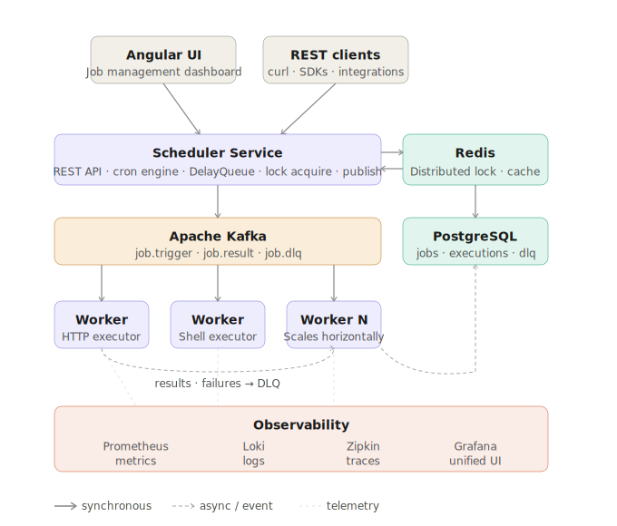

# Distributed Job Scheduler

> 🚧 Under active development — Phase 2 of 5 in progress

A production-grade distributed job scheduler built with Spring Boot,
Kafka, Redis, PostgreSQL, and Angular 21.

Think self-hosted Temporal/Celery — users define jobs, set schedules,
and monitor execution across distributed workers.

## Architecture

## Tech Stack
- **Backend**: Spring Boot 3.5 (Java 21)
- **Messaging**: Apache Kafka 3.7
- **Cache + Locking**: Redis 7.2
- **Database**: PostgreSQL 16
- **Frontend**: Angular 21 + Angular Material + ngx-echarts
- **Observability**: Grafana + Prometheus + Loki + Zipkin
- **DevOps**: Docker Compose + GitHub Actions

## Project Status
| Phase | Description | Status |
|---|---|---|
| 1 | Architecture & Design | ✅ Done |
| 2 | Core Backend | ✅ Done |
| 3 | Observability | ✅ Done |
| 4 | Angular Dashboard |✅ Done |
| 5 | DevOps & Go Live |  ✅ Done |

## Getting Started
_(Setup instructions coming in Phase 5)_
